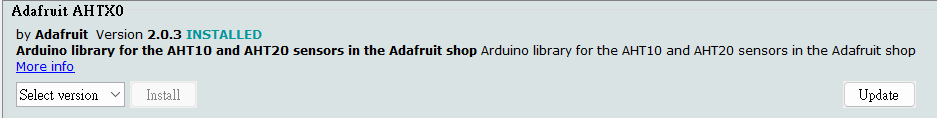
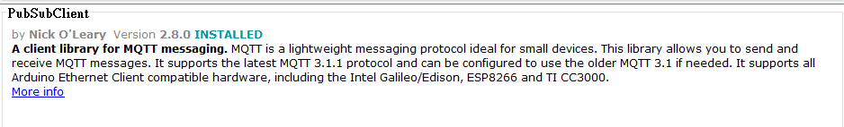
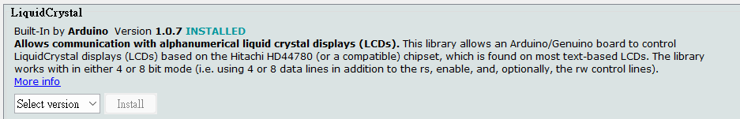
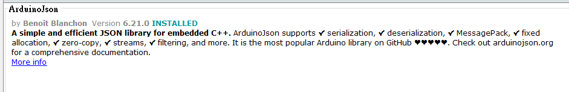
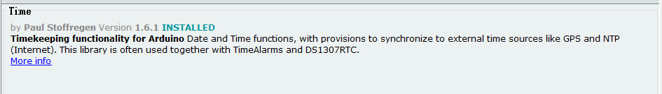

# PetMonitoringSystem Hardware

## Arduino

### Library

```c
#include <ESP8266WiFi.h>
#include <PubSubClient.h>
#include <Wire.h> 
#include <LiquidCrystal_I2C.h> //LiquidCrystal_I2C
#include "Adafruit_AHTX0.h"  // AHT10 library
#include <ArduinoJson.h> //ArduinoJson
#include <TimeLib.h> //Time
```

#### AHT22



#### PubSub



#### LCD



#### JSON/Time




Use phao-mqtt

## Initial Project

```shell=
cd mqtttest
pipenv install
```

## Hardware

Grove Socket

### Use I2C Protocol

1. [AHT10](https://github.com/adafruit/Adafruit_AHTX0/blob/master/examples/adafruit_aht_test/adafruit_aht_test.ino)
2. [I2C LCD Monitor](https://github.com/fdebrabander/Arduino-LiquidCrystal-I2C-library)

### Use Digital Signal

1. [[Pin 8] Water Sensor](https://arduinogetstarted.com/tutorials/arduino-water-sensor)


----

### Publish

pipenv run python pubNew.py

### Subscribe

pipenv run python subNew.py